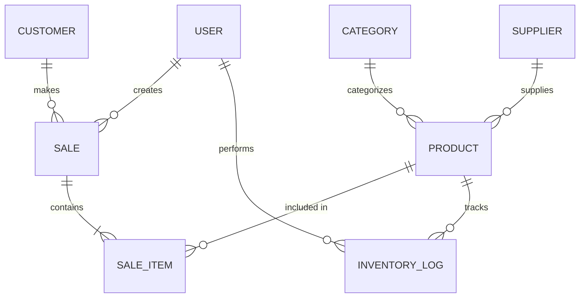

# KriParth POS — Requirements & Design Document

**Version:** 1.0  
**Date:** March 26, 2026  
**Authors:** KriParth Team  
**Status:** Draft

---

## Table of Contents

1. [Introduction](#1-introduction)
2. [Project Scope](#2-project-scope)
3. [Functional Requirements](#3-functional-requirements)
4. [Non-Functional Requirements](#4-non-functional-requirements)
5. [System Architecture](#5-system-architecture)
6. [Database Design](#6-database-design)
7. [API Design](#7-api-design)
8. [AI Integration Design](#8-ai-integration-design)
9. [UI/UX Design](#9-uiux-design)
10. [Security Design](#10-security-design)
11. [Deployment Strategy](#11-deployment-strategy)
12. [Development Phases](#12-development-phases)
13. [Risk Analysis](#13-risk-analysis)

---

## 1. Introduction

### 1.1 Purpose

This document defines the functional and non-functional requirements, system architecture, and design specifications for **KriParth POS** — an AI-powered, web-based Point of Sale system built for small and medium retail businesses.

### 1.2 Background

Small business owners in India and globally face a common challenge: existing POS systems are either prohibitively expensive, overly complex, or provide no actionable business intelligence. Most local shops still rely on manual registers or basic billing apps that offer zero insights into sales trends, inventory optimization, or customer behavior.

KriParth POS addresses this gap by combining a modern POS workflow with **GROK AI-powered intelligence** — making data-driven business decisions accessible to every shopkeeper.

### 1.3 Definitions & Acronyms

| Term | Definition |
|---|---|
| POS | Point of Sale |
| SKU | Stock Keeping Unit |
| ODM | Object Data Modeling |
| JWT | JSON Web Token |
| RBAC | Role-Based Access Control |
| NLP | Natural Language Processing |
| GROK AI | AI platform used for intelligent insights |

---

## 2. Project Scope

### 2.1 In Scope

- Web-based POS billing system
- Product & category management
- Real-time inventory tracking
- Sales analytics & report generation
- AI-powered business insights (GROK AI)
- User authentication & role management
- Customer management & purchase history
- Multi-payment mode support

### 2.2 Out of Scope (v1.0)

- Mobile native apps (iOS/Android)
- Multi-currency support
- Offline mode with sync
- Third-party accounting software integration (Tally, QuickBooks)

---

## 3. Functional Requirements

### 3.1 Authentication & Authorization

| ID | Requirement | Priority |
|---|---|---|
| FR-AUTH-01 | Users can register with email and password | High |
| FR-AUTH-02 | Users can log in and receive a JWT token | High |
| FR-AUTH-03 | Role-based access: Admin, Manager, Cashier | High |
| FR-AUTH-04 | Admin can create, edit, and deactivate user accounts | High |
| FR-AUTH-05 | Password reset via email | Medium |
| FR-AUTH-06 | Session timeout after inactivity (configurable) | Medium |

### 3.2 Product Management

| ID | Requirement | Priority |
|---|---|---|
| FR-PROD-01 | CRUD operations for products | High |
| FR-PROD-02 | Products have: name, SKU, price, cost, category, stock qty, image | High |

| FR-PROD-04 | Product search by name, SKU, or category | High |
| FR-PROD-05 | Product variants (size, color) support | Low |


### 3.3 Billing & Sales

| ID | Requirement | Priority |
|---|---|---|
| FR-SALE-01 | Create a new sale with multiple line items | High |
| FR-SALE-02 | Apply discounts (percentage or flat) per item or whole bill | High |
| FR-SALE-03 | Support payment modes: Cash, UPI, Card, Split Payment | High |
| FR-SALE-04 | Generate digital receipt (PDF) | High |
| FR-SALE-05 | Hold and recall bills | Medium |
| FR-SALE-06 | Process returns and refunds | High |
| FR-SALE-07 | Apply tax (GST) calculations automatically | High |

### 3.4 Inventory Management

| ID | Requirement | Priority |
|---|---|---|
| FR-INV-01 | Real-time stock count updated on each sale | High |
| FR-INV-02 | Low-stock threshold alerts | High |
| FR-INV-03 | Stock adjustment (manual add/remove with reason) | High |
| FR-INV-04 | Supplier management (name, contact, products supplied) | Medium |
| FR-INV-05 | Purchase order creation & tracking | Medium |
| FR-INV-06 | Batch & expiry date tracking | Low |

### 3.5 Analytics & Reporting

| ID | Requirement | Priority |
|---|---|---|
| FR-RPT-01 | Daily, weekly, monthly sales summary | High |
| FR-RPT-02 | Revenue and profit reports | High |
| FR-RPT-03 | Top-selling and slow-moving products | High |
| FR-RPT-04 | Cashier-wise sales performance | Medium |
| FR-RPT-05 | Export reports to PDF | Medium |
| FR-RPT-06 | Dashboard with key metrics (today's sales, items sold, revenue) | High |

### 3.6 AI-Powered Features (GROK AI)

| ID | Requirement | Priority |
|---|---|---|
| FR-AI-01 | Sales trend analysis with forecasting | High |
| FR-AI-02 | Natural language queries ("What sold most last week?") | High |
| FR-AI-03 | Smart restocking recommendations | High |
| FR-AI-04 | Customer purchase pattern insights | Medium |
| FR-AI-05 | Anomaly detection (unusual refunds, revenue drops) | Medium |
| FR-AI-06 | Auto-generated business summary reports | High |

### 3.7 Customer Management

| ID | Requirement | Priority |
|---|---|---|
| FR-CUST-01 | Add/edit customer profiles (name, phone, email) | Medium |
| FR-CUST-02 | Link sales to customers | Medium |
| FR-CUST-03 | View customer purchase history | Medium |
| FR-CUST-04 | Customer loyalty points tracking | Low |

---

## 4. Non-Functional Requirements

| ID | Requirement | Target |
|---|---|---|
| NFR-01 | **Response Time** | API responses < 200ms for CRUD, < 2s for AI queries |
| NFR-02 | **Concurrent Users** | Support 50+ simultaneous users per instance |
| NFR-03 | **Availability** | 99.5% uptime |
| NFR-04 | **Scalability** | Horizontal scaling via containerization |
| NFR-05 | **Security** | OWASP Top 10 compliance |
| NFR-06 | **Browser Support** | Chrome, Firefox, Edge, Safari (latest 2 versions) |
| NFR-07 | **Data Backup** | Automated daily backups with 30-day retention |
| NFR-08 | **Accessibility** | WCAG 2.1 AA compliance |

---

## 5. System Architecture

### 5.1 High-Level Architecture

```
┌─────────────────────────────────────────────────────────────┐
│                        CLIENT TIER                          │
│                                                             │
│   ┌─────────────────────────────────────────────────────┐   │
│   │              React.js SPA (Vite Build)              │   │
│   │  ┌───────────┐ ┌──────────┐ ┌───────────────────┐  │   │
│   │  │  Pages    │ │Components│ │  State Management │  │   │
│   │  │  (Views)  │ │(Reusable)│ │  (Context/Redux)  │  │   │
│   │  └───────────┘ └──────────┘ └───────────────────┘  │   │
│   │  ┌─────────────────────────────────────────────┐    │   │
│   │  │         API Service Layer (Axios)           │    │   │
│   │  └─────────────────────┬───────────────────────┘    │   │
│   └────────────────────────┼────────────────────────────┘   │
└────────────────────────────┼────────────────────────────────┘
                             │ HTTPS / REST API
┌────────────────────────────┼────────────────────────────────┐
│                    SERVER TIER                               │
│   ┌────────────────────────▼────────────────────────────┐   │
│   │             Express.js Application                  │   │
│   │                                                     │   │
│   │  ┌──────────────────────────────────────────────┐   │   │
│   │  │              Middleware Stack                 │   │   │
│   │  │  CORS │ Auth(JWT) │ Validation │ Rate Limit  │   │   │
│   │  └──────────────────────────────────────────────┘   │   │
│   │                                                     │   │
│   │  ┌────────────┐  ┌───────────┐  ┌──────────────┐   │   │
│   │  │   Routes   │  │Controllers│  │   Services   │   │   │
│   │  │  /api/*    │→ │ (Handlers)│→ │(Business     │   │   │
│   │  │            │  │           │  │  Logic)      │   │   │
│   │  └────────────┘  └───────────┘  └──────┬───────┘   │   │
│   │                                        │           │   │
│   │                    ┌───────────────┬────┘           │   │
│   │                    │               │               │   │
│   │            ┌───────▼──────┐ ┌──────▼───────┐       │   │
│   │            │   Mongoose   │ │  GROK AI     │       │   │
│   │            │   ODM Layer  │ │  Service     │       │   │
│   │            └───────┬──────┘ └──────────────┘       │   │
│   └────────────────────┼───────────────────────────────┘   │
└────────────────────────┼───────────────────────────────────┘
                         │
┌────────────────────────┼───────────────────────────────────┐
│                   DATA TIER                                 │
│   ┌────────────────────▼───────────────────────────────┐   │
│   │               MongoDB (Atlas)                      │   │
│   │                                                    │   │
│   │  ┌──────────┐ ┌──────────┐ ┌──────────────────┐   │   │
│   │  │  Users   │ │ Products │ │  Sales/Invoices  │   │   │
│   │  └──────────┘ └──────────┘ └──────────────────┘   │   │
│   │  ┌──────────┐ ┌──────────┐ ┌──────────────────┐   │   │
│   │  │Inventory │ │Customers │ │  AI Query Logs   │   │   │
│   │  └──────────┘ └──────────┘ └──────────────────┘   │   │
│   └────────────────────────────────────────────────────┘   │
└────────────────────────────────────────────────────────────┘
```

### 5.2 Technology Justification

| Technology | Why We Chose It |
|---|---|
| **React JS** | Component-based architecture enables fast, reusable UI development. Massive ecosystem and community support. |
| **Node.js** | JavaScript on both client and server reduces context-switching. Event-driven, non-blocking I/O ideal for real-time POS operations. |
| **Express.js** | Minimal, flexible framework for building RESTful APIs quickly. Rich middleware ecosystem. |
| **MongoDB** | Schema-flexible NoSQL aligns perfectly with evolving retail data structures. Handles high-throughput read/write operations well. |
| **Mongoose** | Provides schema validation, query building, and middleware hooks on top of MongoDB, ensuring data integrity. |
| **GROK AI** | Advanced NLP and analytical capabilities for generating business insights from sales data. |

---

## 6. Database Design

### 6.1 Collections & Schemas

#### User

```javascript
{
  _id: ObjectId,
  name: String,                // required
  email: String,               // required, unique
  password: String,            // hashed with bcrypt
  role: String,                // enum: ['admin', 'manager', 'cashier']
  phone: String,
  isActive: Boolean,           // default: true
  lastLogin: Date,
  createdAt: Date,
  updatedAt: Date
}
```

#### Product

```javascript
{
  _id: ObjectId,
  name: String,                // required
  sku: String,                 // required, unique
  description: String,
  category: ObjectId,          // ref: Category
  price: Number,               // selling price
  costPrice: Number,           // purchase/cost price
  stock: Number,               // current quantity
  lowStockThreshold: Number,   // default: 10
  unit: String,                // enum: ['piece', 'kg', 'liter', 'pack']
  image: String,               // URL

  isActive: Boolean,
  createdBy: ObjectId,         // ref: User
  createdAt: Date,
  updatedAt: Date
}
```

#### Sale / Invoice

```javascript
{
  _id: ObjectId,
  invoiceNumber: String,       // auto-generated, unique
  items: [{
    product: ObjectId,         // ref: Product
    name: String,              // snapshot at time of sale
    quantity: Number,
    unitPrice: Number,
    discount: Number,
    total: Number
  }],
  subtotal: Number,
  taxAmount: Number,
  taxRate: Number,             // GST percentage
  discount: Number,            // bill-level discount
  grandTotal: Number,
  paymentMode: String,         // enum: ['cash', 'upi', 'card', 'split']
  paymentDetails: {
    cashAmount: Number,
    cardAmount: Number,
    upiAmount: Number,
    transactionId: String
  },
  customer: ObjectId,          // ref: Customer (optional)
  cashier: ObjectId,           // ref: User
  status: String,              // enum: ['completed', 'refunded', 'void']
  notes: String,
  createdAt: Date
}
```

#### Inventory Log

```javascript
{
  _id: ObjectId,
  product: ObjectId,           // ref: Product
  type: String,                // enum: ['sale', 'restock', 'adjustment', 'return']
  quantity: Number,            // positive for add, negative for remove
  previousStock: Number,
  newStock: Number,
  reason: String,
  performedBy: ObjectId,       // ref: User
  reference: ObjectId,         // ref: Sale (if applicable)
  createdAt: Date
}
```

#### Customer

```javascript
{
  _id: ObjectId,
  name: String,                // required
  phone: String,               // required, unique
  email: String,
  address: String,
  loyaltyPoints: Number,       // default: 0
  totalPurchases: Number,      // running total
  createdAt: Date,
  updatedAt: Date
}
```

#### Category

```javascript
{
  _id: ObjectId,
  name: String,                // required, unique
  description: String,
  parentCategory: ObjectId,    // ref: Category (for sub-categories)
  isActive: Boolean,
  createdAt: Date
}
```

### 6.2 Entity Relationship Diagram



---

## 7. API Design

### 7.1 API Standards

- **Base URL:** `/api/v1`
- **Format:** JSON
- **Authentication:** Bearer Token (JWT)
- **Error Format:**
  ```json
  {
    "success": false,
    "error": {
      "code": "VALIDATION_ERROR",
      "message": "Product name is required",
      "details": [...]
    }
  }
  ```
- **Success Format:**
  ```json
  {
    "success": true,
    "data": { ... },
    "meta": { "page": 1, "totalPages": 5, "totalItems": 48 }
  }
  ```

### 7.2 Endpoint Specifications

#### Authentication

| Method | Endpoint | Description | Access |
|---|---|---|---|
| POST | `/auth/register` | Register new user | Admin |
| POST | `/auth/login` | Login, returns JWT | Public |
| POST | `/auth/logout` | Invalidate token | Authenticated |
| POST | `/auth/forgot-password` | Send reset email | Public |
| PUT | `/auth/reset-password/:token` | Reset password | Public |

#### Products

| Method | Endpoint | Description | Access |
|---|---|---|---|
| GET | `/products` | List products (paginated, filterable) | Authenticated |
| GET | `/products/:id` | Get single product | Authenticated |
| POST | `/products` | Create product | Admin, Manager |
| PUT | `/products/:id` | Update product | Admin, Manager |
| DELETE | `/products/:id` | Soft-delete product | Admin |


#### Sales

| Method | Endpoint | Description | Access |
|---|---|---|---|
| POST | `/sales` | Create new sale | Cashier+ |
| GET | `/sales` | List sales (filterable by date, cashier) | Manager+ |
| GET | `/sales/:id` | Get sale details | Cashier+ |
| POST | `/sales/:id/refund` | Process refund | Manager+ |
| GET | `/sales/:id/receipt` | Generate receipt PDF | Cashier+ |

#### Inventory

| Method | Endpoint | Description | Access |
|---|---|---|---|
| GET | `/inventory` | Get stock levels | Authenticated |
| GET | `/inventory/alerts` | Get low-stock alerts | Manager+ |
| POST | `/inventory/adjust` | Manual stock adjustment | Manager+ |
| GET | `/inventory/logs` | Inventory change history | Manager+ |

#### Reports

| Method | Endpoint | Description | Access |
|---|---|---|---|
| GET | `/reports/sales` | Sales report (daily/weekly/monthly) | Manager+ |
| GET | `/reports/revenue` | Revenue & profit report | Admin |
| GET | `/reports/products/top` | Top-selling products | Manager+ |
| GET | `/reports/cashier-performance` | Cashier performance | Admin |
| GET | `/reports/export/:type` | Export report (PDF) | Manager+ |

#### AI (GROK Integration)

| Method | Endpoint | Description | Access |
|---|---|---|---|
| POST | `/ai/query` | Natural language business query | Manager+ |
| GET | `/ai/insights` | Get AI-generated insights | Manager+ |
| GET | `/ai/forecast` | Sales forecasting | Admin |
| GET | `/ai/anomalies` | Detected anomalies | Admin |

---

## 8. AI Integration Design

### 8.1 GROK AI Integration Architecture

```
┌───────────────────────────────────────┐
│           User Query / Trigger        │
│  "What was my best product this week?"│
└──────────────────┬────────────────────┘
                   │
┌──────────────────▼────────────────────┐
│        AI Service (server-side)       │
│                                       │
│  1. Parse & classify the query        │
│  2. Fetch relevant data from MongoDB  │
│  3. Build context prompt              │
│  4. Send to GROK AI API              │
│  5. Parse AI response                 │
│  6. Cache result (TTL: 15 min)       │
│  7. Return formatted response         │
└──────────────────┬────────────────────┘
                   │
┌──────────────────▼────────────────────┐
│          GROK AI API                  │
│  - Receives structured prompt         │
│  - Returns analysis / answer          │
└───────────────────────────────────────┘
```

### 8.2 AI Feature Specifications

| Feature | Input Data | GROK AI Prompt Strategy | Output |
|---|---|---|---|
| **Sales Trends** | Last 30/90 days of sales | Time-series data + "Identify trends and patterns" | Trend graph data + text summary |
| **NLP Queries** | User's natural language question | Question + relevant DB context | Direct answer in natural language |
| **Restock Suggestions** | Inventory levels + sales velocity | Stock data + "Recommend reorder quantities" | Product-wise reorder list |
| **Anomaly Detection** | Sales, refunds, void transactions | Transaction data + "Flag unusual patterns" | Alert list with severity |
| **Business Summary** | All aggregate data from the period | Comprehensive data + "Generate executive summary" | Markdown-formatted report |

### 8.3 Rate Limiting & Caching

- GROK AI API calls are rate-limited to **60 requests/min** per store
- AI insight responses are cached in MongoDB with a **15-minute TTL**
- Scheduled batch analysis runs every **6 hours** to pre-compute common insights
- Fallback: If GROK AI is unreachable, display last cached insights with a staleness indicator

---

## 9. UI/UX Design

### 9.1 Core Screens

| Screen | Description | User Roles |
|---|---|---|
| **Login** | Email/password login with branding | All |
| **Dashboard** | KPI cards, live sales chart, alerts | Manager, Admin |
| **POS / Billing** | Full-screen billing interface with product grid | Cashier |
| **Products** | Product list, add/edit forms, bulk import | Manager, Admin |
| **Inventory** | Stock levels, adjustments, suppliers | Manager, Admin |
| **Sales History** | Searchable/filterable sales list, receipt view | Manager, Admin |
| **Reports** | Charts, tables, export options | Manager, Admin |
| **AI Insights** | Chat-like query interface, insight cards | Manager, Admin |
| **Settings** | Store info, tax config, user management | Admin |

### 9.2 Design Principles

- **Speed-First Billing UI** — Cashiers must complete a sale in under 10 seconds. Keyboard shortcuts, large touch targets, minimal clicks.
- **Responsive Layout** — Works on tablets (primary use case) and desktops.
- **Dark/Light Mode** — Reduce eye strain during long shifts.
- **Consistent Design Language** — Uniform spacing, typography, and color system using a design token approach.

### 9.3 Component Library

Key reusable React components:

| Component | Usage |
|---|---|
| `<ProductCard>` | Product grid in billing screen |
| `<InvoiceTable>` | Line items in billing & sales history |
| `<KPICard>` | Dashboard metric cards |
| `<DataTable>` | Sortable/filterable tables across app |
| `<SearchBar>` | Global and contextual search |
| `<Modal>` | Confirmations, forms, alerts |
| `<Chart>` | Wrappers around chart.js or recharts |
| `<AIQueryBox>` | Chat-like AI interface |

---

## 10. Security Design

### 10.1 Authentication Flow

```
[Login Form] → POST /auth/login
    → Validate credentials (bcrypt compare)
    → Generate JWT (access token: 1h, refresh token: 7d)
    → Return tokens to client
    → Client stores access token in memory, refresh token in httpOnly cookie

[Subsequent Requests]
    → Attach access token in Authorization header
    → Middleware validates JWT, extracts user role
    → Route-level RBAC check
```

### 10.2 Security Measures

| Measure | Implementation |
|---|---|
| Password Hashing | bcrypt with 12 salt rounds |
| Token Security | JWT with short expiry + refresh tokens |
| Input Validation | express-validator on all inputs |
| SQL/NoSQL Injection | Mongoose parameterized queries |
| Rate Limiting | express-rate-limit (100 req/15min per IP) |
| CORS | Whitelist specific origins only |
| Helmet.js | Secure HTTP headers |
| HTTPS | Enforced in production |
| Audit Logging | Log all sensitive operations (user changes, refunds, voids) |

---

## 11. Deployment Strategy

### 11.1 Environments

| Environment | Purpose | Database |
|---|---|---|
| Development | Local development | Local MongoDB or Atlas free tier |
| Staging | Pre-release testing | Atlas M10 |
| Production | Live system | Atlas M30+ |

### 11.2 Deployment Options

**Option A: Cloud VPS (Recommended for v1.0)**
- Deploy on AWS EC2 / DigitalOcean / Railway
- PM2 for Node.js process management
- Nginx as reverse proxy
- Let's Encrypt SSL

**Option B: Container-Based (v2.0+)**
- Docker Compose for local development
- Kubernetes for scaled production
- CI/CD via GitHub Actions

### 11.3 CI/CD Pipeline

```
Push to main → GitHub Actions
    → Lint (ESLint)
    → Unit Tests (Jest)
    → Integration Tests
    → Build (Vite)
    → Deploy to Staging
    → Smoke Tests
    → Manual Approval
    → Deploy to Production
```

---

## 12. Development Phases

### Phase 1: Foundation (Weeks 1–3)

- [x] Project setup (repo, folder structure, tooling)
- [ ] User authentication (register, login, JWT)
- [ ] Role-based access control
- [ ] Product CRUD with categories
- [ ] Basic UI: Login, Dashboard shell, Product management

### Phase 2: Core POS (Weeks 4–6)

- [ ] Billing / POS screen
- [ ] Cart management & checkout flow
- [ ] Payment processing (Cash, UPI, Card)
- [ ] Receipt generation (digital)
- [ ] Inventory auto-update on sale

### Phase 3: Inventory & Reporting (Weeks 7–9)

- [ ] Inventory management screens
- [ ] Low-stock alerts
- [ ] Sales reports (daily/weekly/monthly)
- [ ] Dashboard KPIs and charts
- [ ] Sales history with filters

### Phase 4: AI Integration (Weeks 10–12)

- [ ] GROK AI service setup
- [ ] Natural language query interface
- [ ] Sales trend analysis
- [ ] Smart restocking recommendations
- [ ] Auto-generated business summaries

### Phase 5: Polish & Launch (Weeks 13–14)

- [ ] Customer management
- [ ] Export reports (PDF)
- [ ] Dark/light mode
- [ ] Performance optimization
- [ ] Security audit
- [ ] Deployment to production

---

## 13. Risk Analysis

| Risk | Likelihood | Impact | Mitigation |
|---|---|---|---|
| GROK AI API downtime | Medium | Medium | Cache recent insights, show fallback UI, queue retries |
| MongoDB performance degradation | Low | High | Proper indexing, connection pooling, Atlas monitoring |
| Security breach | Low | Critical | Follow OWASP Top 10, regular audits, JWT rotation |
| Scope creep beyond v1 | High | Medium | Strict phase adherence, feature flagging |
| Browser compatibility issues | Low | Medium | Automated cross-browser testing, progressive enhancement |
| Data loss | Low | Critical | Automated daily backups, point-in-time recovery (Atlas) |

---

## Appendix A: Glossary

| Term | Description |
|---|---|
| **Invoice** | A record of a completed sale transaction |
| **SKU** | A unique identifier for each distinct product |
| **GST** | Goods and Services Tax (India) |
| **RBAC** | Role-Based Access Control — restricting system access by user role |
| **TTL** | Time To Live — duration an item remains in cache |

---

*This is a living document and will be updated as the project evolves.*
